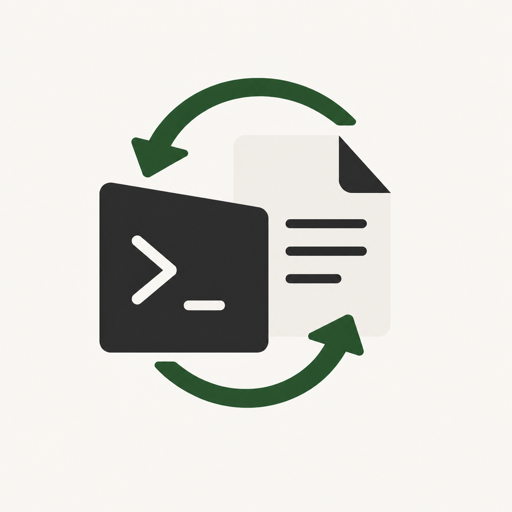

<p align="center">
  
</p>

# Overleaf CLI

An unofficial command-line client for safe, bidirectional synchronization
between a local directory and an Overleaf project.

[](https://github.com/cafferychen777/overleaf-cli/actions/workflows/ci.yml)
[](LICENSE)

> [!IMPORTANT]
> This project uses undocumented Overleaf web APIs and may need updates when
> Overleaf changes its protocol. It is not affiliated with or endorsed by
> Overleaf.

## Why this exists

Overleaf CLI keeps one local folder linked to one Overleaf project while making
destructive behavior explicit:

- text files synchronize through Overleaf's operational-transformation socket
  protocol;
- binary files upload and download through HTTP;
- conflicting local files are archived instead of silently overwritten;
- overlapping text edits stop automatic writes and produce a conflict copy;
- remote-only files are preserved unless `--prune-remote` is requested;
- remote paths and symbolic-link escapes are validated before local I/O.

The executable is named `overleaf-cli` to describe its primary operation.

## Requirements

- Node.js 20 or later
- An Overleaf account, or access to a compatible self-hosted Overleaf instance
- A POSIX-like shell for the credential examples below

## Install

### Install from npm

```bash
npm install -g @cafferychen777/overleaf-cli
overleaf-cli --help
```

### Install from source

```bash
git clone https://github.com/cafferychen777/overleaf-cli.git
cd overleaf-cli
npm ci
npm test
npm link
```

Then confirm the executable is available:

```bash
overleaf-cli --help
```

### Install the Codex skill

This repository includes a companion Codex skill with command guidance,
credential safeguards, conflict handling, and maintainer workflows. After an
npm installation, install the bundled skill globally with:

```bash
package_root="$(npm root -g)/@cafferychen777/overleaf-cli"
skill_root="${CODEX_HOME:-$HOME/.codex}/skills"
mkdir -p "$skill_root"
cp -R "$package_root/skills/overleaf-cli" "$skill_root/"
```

From a repository checkout, use:

```bash
skill_root="${CODEX_HOME:-$HOME/.codex}/skills"
mkdir -p "$skill_root"
cp -R skills/overleaf-cli "$skill_root/"
```

To keep the skill scoped to one workspace instead, copy it to that workspace's
`.agents/skills/` directory:

```bash
mkdir -p /path/to/workspace/.agents/skills
cp -R skills/overleaf-cli /path/to/workspace/.agents/skills/
```

Invoke it as `$overleaf-cli` when asking Codex to synchronize, diagnose, or
maintain this CLI. Restart Codex if the newly installed skill is not discovered
in the current session.

During development, `node out/index.js` can be used instead of the linked
executable after running `npm run build`.

## Authenticate without exposing credentials

An Overleaf session cookie is equivalent to an authenticated browser session.
Never commit it, paste it into an issue, or pass it as a command-line argument.

Read the cookie without echoing it or storing it in shell history:

```bash
read -rs OVERLEAF_COOKIE
export OVERLEAF_COOKIE
overleaf-cli login
unset OVERLEAF_COOKIE
```

Email and password authentication is also available when the server accepts a
normal password flow without CAPTCHA:

```bash
read -r OVERLEAF_EMAIL
read -rs OVERLEAF_PASSWORD
export OVERLEAF_EMAIL OVERLEAF_PASSWORD
overleaf-cli login
unset OVERLEAF_EMAIL OVERLEAF_PASSWORD
```

Use `--server https://your-overleaf.example` with `login`, `list`, `pull`, or
`init` for a compatible self-hosted instance.

Credentials are stored outside the repository in
`~/.overleaf-cli/config.json`. On POSIX systems, the directory is restricted
to the current user and the file is written with mode `0600`. See
[SECURITY.md](SECURITY.md) before reporting authentication issues.

## Quick start

```bash
overleaf-cli list
overleaf-cli pull <project-id> ./my-paper
overleaf-cli watch ./my-paper
```

After `pull` or `init`, `.overleaf-cli.json` links the local directory to its
remote project. Keep this file private: it contains project metadata even
though it does not contain login credentials.

## Commands

```text
overleaf-cli login [-s server]
overleaf-cli list [-s server]
overleaf-cli pull <projectId> [localDir] [-s server] [--force]
overleaf-cli init <projectName> [localDir] [-s server]
overleaf-cli push [localDir] [--prune-remote]
overleaf-cli diff [localDir]
overleaf-cli watch [localDir]
overleaf-cli compile [localDir] [--compiler pdflatex|xelatex|lualatex]
overleaf-cli history list [localDir] [--limit N]
overleaf-cli history diff <fromVersion> <toVersion> [localDir] [--file path]
overleaf-cli history export <version> [localDir] [--output path]
overleaf-cli history restore <version> [localDir] --file path
overleaf-cli share list [localDir]
overleaf-cli share invite <email> [localDir] --role viewer|reviewer|editor
overleaf-cli share set-role <userId> [localDir] --role viewer|reviewer|editor
overleaf-cli share remove <userId> [localDir]
overleaf-cli share revoke <inviteId> [localDir]
overleaf-cli share resend <inviteId> [localDir]
overleaf-cli --verbose <command>
```

### Synchronization

- `pull` downloads a remote project and creates the local project link. By
  default, differing local files are moved into `.overleaf-cli-conflicts/`.
  `--force` disables that archive and intentionally permits overwrites.
- `push` uploads local additions and changes once. It only propagates deletions
  for paths previously tracked by this replica.
- `push --prune-remote` is destructive mirror mode: remote paths missing
  locally are deleted.
- `watch` keeps both sides synchronized, retries transient socket failures, and
  preserves unsynchronized local text across reconnects when a merge base is
  available.
- `diff` shows a unified local-versus-remote diff without changing either side.

When local and remote text edits overlap, automatic pushing stops. The visible
local file is preserved and the remote snapshot is written under
`.overleaf-cli-conflicts/` for manual reconciliation. Non-overlapping edits
continue to merge automatically.

For slow networks, adjust the explicit timeouts:

```bash
OVERLEAF_CLI_SOCKET_TIMEOUT_MS=30000 overleaf-cli watch ./my-paper
OVERLEAF_CLI_HTTP_TIMEOUT_MS=60000 overleaf-cli pull <project-id> ./my-paper
```

### Compilation

`compile` triggers Overleaf compilation and downloads the primary output as
`output.pdf`. If compilation fails and a log artifact is available, it is
written as `output.log`.

### Project history

`history list`, `history diff`, and `history export` are read-only.
`history restore --file ...` asks Overleaf to restore one historical file and
may create a new remote file name rather than overwrite the current one. Run
`pull` or `watch` afterward to synchronize that result locally.

Whole-project history restore is intentionally not exposed because its route
has not been verified as stable on `overleaf.com`.

### Sharing

`share` manages collaborators and pending invitations. Some servers require a
CAPTCHA for email invitations; in that case, finish the invitation in the web
interface. Projects that are readable but not administrable may show pending
invitations as unavailable while still listing collaborators.

## Ignore rules

Hidden files and common LaTeX build artifacts are ignored by default. Add
project-specific patterns to `.overleaf-cliignore` using gitignore syntax:

```gitignore
build/
/tmp/**
*.zip
```

`watch` reloads this file automatically.

## Local state

The CLI maintains the following files so synchronization can be safe and
recoverable:

- `~/.overleaf-cli/config.json`: login state for each server;
- `.overleaf-cli.json`: local-to-remote project binding;
- `.overleaf-cli-hashes.json`: binary hashes used to skip unchanged uploads;
- `.overleaf-cli-tracked.json`: paths previously synchronized by this replica;
- `.overleaf-cli-cache/`: confirmed text snapshots used as merge bases;
- `.overleaf-cli-conflicts/`: archived conflicts requiring manual review.

The repository's `.gitignore` excludes credential files and all generated
Overleaf state except `.overleaf-cliignore`, which is designed to be shared.

## Development

```bash
npm ci
npm test
npm run check
npm pack --dry-run
```

The test suite covers path traversal, symbolic-link escapes, atomic state
writes, conflict preservation, merge safety, cookie rotation, HTTP range
handling, compilation output selection, sharing, and project history.

## License and attribution

Overleaf CLI is licensed under the
[GNU Affero General Public License v3.0 only](LICENSE). Its Overleaf integration
was adapted from the AGPL-licensed
[Overleaf Workshop](https://github.com/overleaf-workshop/overleaf-workshop)
project. See [NOTICE.md](NOTICE.md) for attribution and trademark information.
